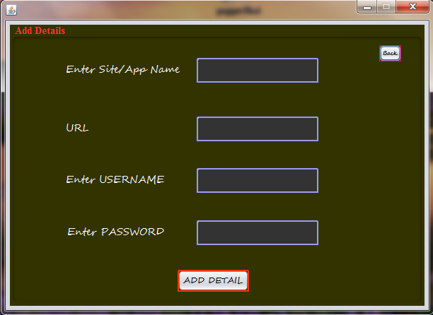

# Password Manager using Java

This is a small java gui project for beginner students.
This project created in Java using Java Swing library and SQLite database.


## Badges


[](https://choosealicense.com/licenses/mit/)
[](https://opensource.org/licenses/)
[](http://www.gnu.org/licenses/agpl-3.0)


## Features

- Login
- Add Data
- Show Data
- Edit Data
- Delete Data


## Usage/Examples

```javascript
Demo : 
Goto '/Login/dist' folder and dubble click on Login.jar

```


## Installation

How to Import Project

```bash
  Download/clone this project and import in Netbeans IDE
```
    
## Screenshots





## FAQ

#### Database not found error

Edit this location on every java file
```C:\Users\dbuu\Documents\NetBeansProjects\Login\src\login\maal.db``` 

goto ```\Login\src\login\``` and right click on ```maal.db``` and copy location of this file and replace this new location from every java file in ```src``` folder


